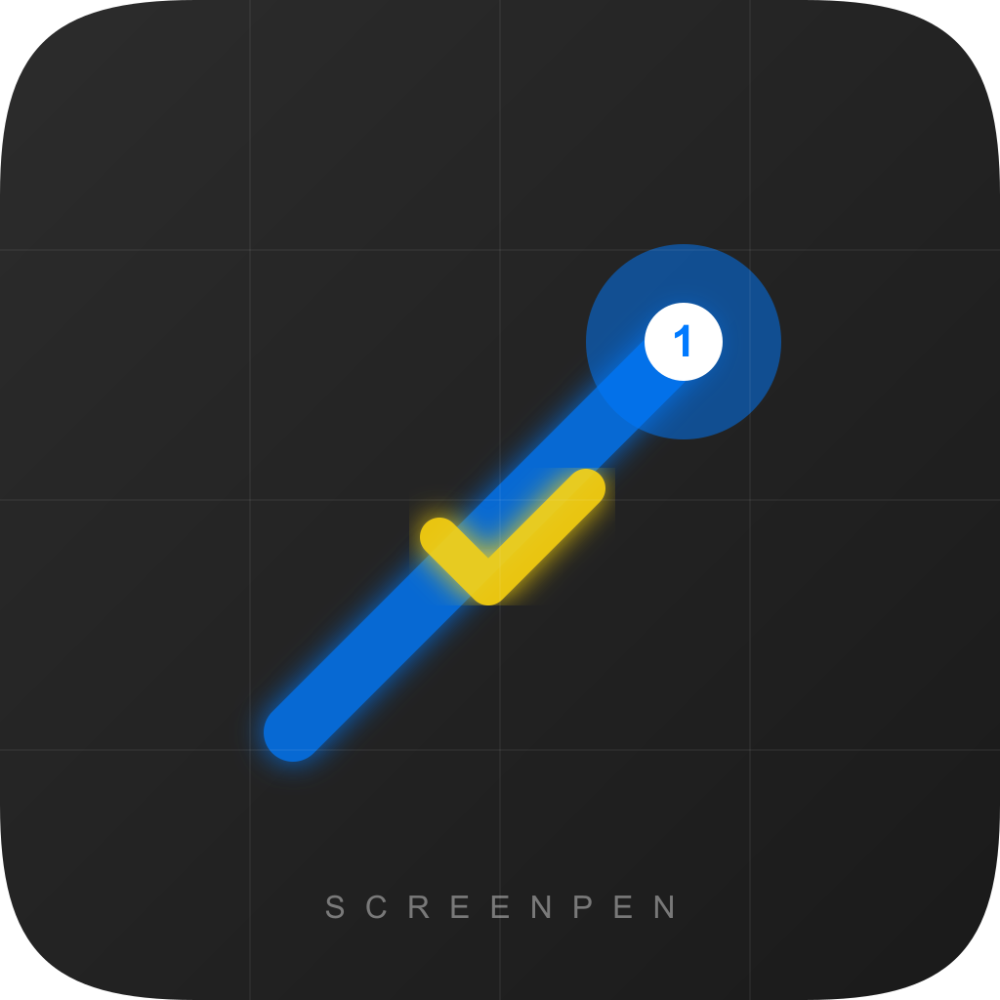
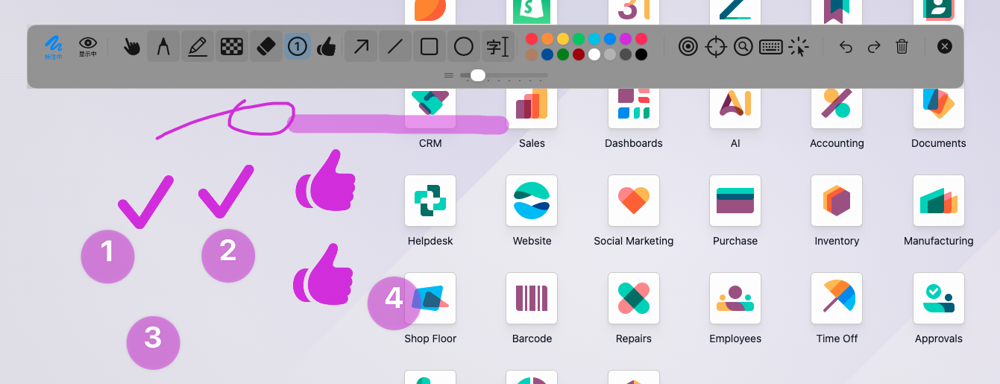
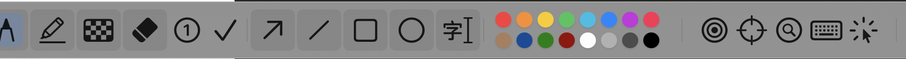

# ScreenPen (Offline Activation Version) | 屏幕标注与演示增强神器 🖋️✨

**The ultimate screen annotation and presentation tool for macOS professionals.**
**专为 macOS 专业人士打造的终极屏幕标注与教学演示增强工具。**

---

## 🌟 Introduction | 产品简介

ScreenPen is a powerful, lightweight, and high-performance screen annotation suite built natively for macOS. Designed for lecturers, developers, and presenters who need a reliable way to guide their audience's attention in real-time.

ScreenPen 是一款专为 macOS 原生打造、高性能且轻量的屏幕标注套件。它是培训讲师、开发者、主播以及演示者的理想伙伴，助您在实时演示中精准引导观众注意力。

**This is the "Offline Activation" version**, offering machine-locked permanent licenses without Apple ID dependencies.
**这是“线下激活版”**，提供基于机器码绑定的永久授权，无需依赖 Apple ID，适合个人及企业私有化部署。

---

## 🚀 Key Features | 核心功能

### 🖋️ Professional Annotation | 专业标注
- **Zero-Latency Drawing | 零延迟书写**: GPU-accelerated rendering using Apple's QuartzCore. | 基于 QuartzCore 的 GPU 加速渲染。
- **Precision Shapes | 精准形状**: Lines, Arrows, Rectangles, and Circles. | 直线、箭头、矩形、圆形一应俱全。
- **Smart Highlighter | 智能荧光笔**: Semi-transparent overlays. | 半透明叠加，突出重点不遮挡背景。
- **Mosaic Privacy | 局部马赛克**: Quickly blur sensitive information. | 快速遮盖敏感信息。

### 💎 PRO Productivity (Exclusives) | PRO 生产力增强
- **Dynamic Step Counter | 动态步骤计数器**: One-click numbered badges (1, 2, 3...) with automatic re-ordering. | 一键放置自动递增编号，删除中间编号自动补位，教学演示必备。
- **SF Symbol Stamps | 原生印章图标**: 20+ professional icons (Checkmarks, Stars, Warnings). | 20+ 种原生矢量图标，支持动态变色。
- **Advanced Selection | 笔迹编辑与移动**: Move and adjust existing annotations fluidly. | 自由移动和调整已有的笔迹位置。
- **Extended Undo | 无限撤销**: Large history stack for complex workflows. | 极长撤销历史，支持复杂逻辑演示。

### 📺 Presentation Suite | 演示辅助套件
- **Laser Pointer | 激光笔**: Persistent trail for tracking movement. | 带拖尾效果的激光笔。
- **Spotlight | 聚光灯**: Focus attention on specific areas. | 强制聚焦屏幕特定区域。
- **Live Magnifier | 实时放大镜**: Real-time zoom-in for fine details. | 实时局部放大，展示细节。
- **Keystroke Caster | 按键回显**: Visualize shortcuts for the audience. | 实时显示快捷键操作。

---

## 🛡️ Trial & Activation | 试用与激活

1.  **Download | 下载**: Get the latest `.app` from our [Releases](https://github.com/jeffery9/ScreenPen-Public-Site/releases) page.
2.  **Trial | 试用**: Enjoy **7 days of full PRO features** for free. | 首次安装即可开启 **7 天全功能免费试用**。
3.  **Get Machine ID | 获取指纹**: After the trial, open the activation window to find your unique **Machine ID**. | 试用结束后，在激活窗口查看您的唯一**设备指纹 (Machine ID)**。
4.  **Activate | 激活**: Send your Machine ID to the author to receive your lifetime key. | 将 Machine ID 发送给作者，获取您的专属终身激活码。

---

## 💰 Pricing | 方案与定价

| License Type | Price | Features | Support |
| :--- | :--- | :--- | :--- |
| **Standard (基础版)** | **Free | 免费** | Basic Pen & Shapes | Community |
| **PRO Lifetime (终身版)** | **$19.9 / ￥128** | **All Productivity Tools** | Priority Email |

*One-time purchase. Lifetime updates. No subscriptions. | 一次性买断，终身免费更新，无订阅费。*

---

## 📧 Contact Author | 联系作者

For license inquiries, business cooperation, or feedback:
如有激活码购买、商务合作或功能反馈，请联系：

- **Email**: [jeffery9@gmail.com](mailto:jeffery9@gmail.com)
- **Author**: Jeffery

---

## 🔧 Installation | 安装指南

1.  Download `ScreenPen-Unlocked-v1.1.0.zip` from [Releases](https://github.com/jeffery9/ScreenPen-Public-Site/releases).
2.  Extract and drag `ScreenPen-Unlocked.app` to your `Applications` folder.
3.  **Permissions | 权限说明**: ScreenPen requires **Screen Recording** (for Magnifier) and **Accessibility** (for Keystrokes). | 应用需要**屏幕录制**（用于放大镜）和**辅助功能**（用于按键回显）权限，请根据系统提示授予。

---
*Keywords: macOS screen pen, screen marker, presentation tool, lecture assistant, recording tool, electronic pointer, 屏幕画笔, 教学演示, 电子教鞭, 录屏辅助, 标注工具.*

*Developed with ❤️ for the macOS community.*
